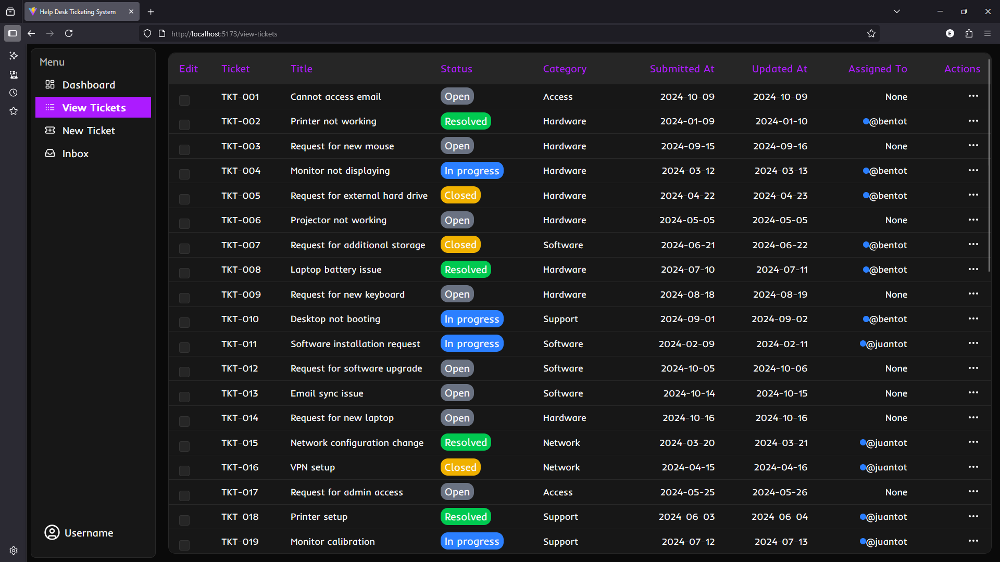
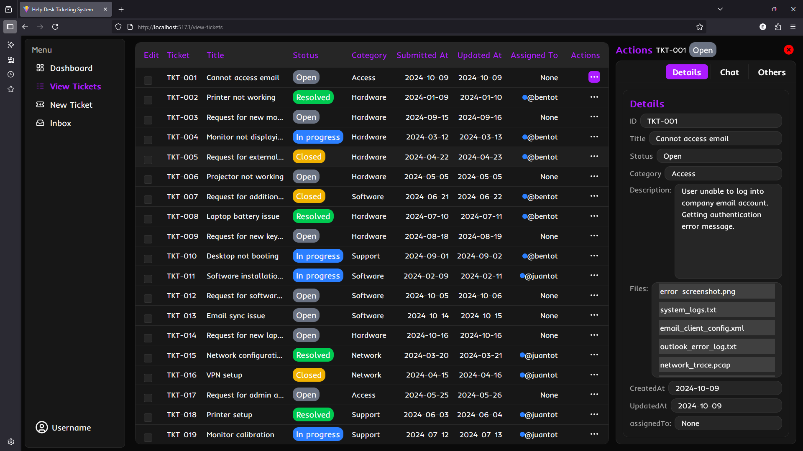
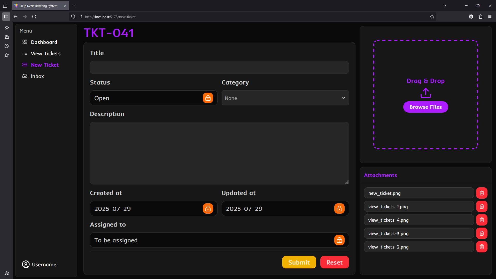

## INSTRUCTION

Follow the steps below to check the current state of the application.

### 1. Clone my repository

```
git clone https://github.com/ItIsMeMyselfAndI/help-desk-ticketing-system.git
```

### 2. Navigate to the created folder

```
cd help-desk-ticketing-system/frontend
```

### 3. Install the dependencies

```
npm install
```

### 4. Run the application locally

```
npm run dev
```

### 5. Open the application in your browser

```
http://localhost:5173/
```

---

## HELP DESK TICKETING SYSTEM

A web-based support ticketing system that allows clients to report issues and enables support teams to track, manage, and resolve them efficiently.

---

### Features (Roles)

#### 1. Admin

- Manage all users (clients and support staff)
- View and manage all tickets
- Assign tickets to support staff
- Update or override ticket statuses
- Delete inappropriate or spam tickets

#### 2. Clients

- Register and log in to their account
- Create and submit new issue tickets
- View and track the status of their own tickets
- Add replies or follow-up comments to tickets
- View ticket resolution history

#### 3. Support Staff

- Register and log in to their account
- View all assigned and open tickets
- Add comments and solutions to tickets
- Update ticket statuses (e.g., Open → In progress → Resolved)
- View ticket history and client interactions

---

### Progress

See current progress - [Help Desk Ticketing System](https://help-desk-ticketing-system-ashen.vercel.app/)

#### Client interface

#### 1. Dashboard


#### 2. View-tickets

- ##### a. Closed action section

  

- ##### b. Opened action section [details]

  

- ##### c. Opened action section [chat]

  

- ##### c. Opened action section [others]

  

#### 3. New-ticket



---

### Wireframe (Figma)

See wireframe - [Figma](https://www.figma.com/design/NXD9zZWMqSGBfUK8sOjD32/Help-Desk-Ticket-System?node-id=60-4&t=uJqbF0tHFrYApNyi-1)

#### Client interface

#### 1. Dashboard


#### 2. View Tickets


#### 3. New Ticket


